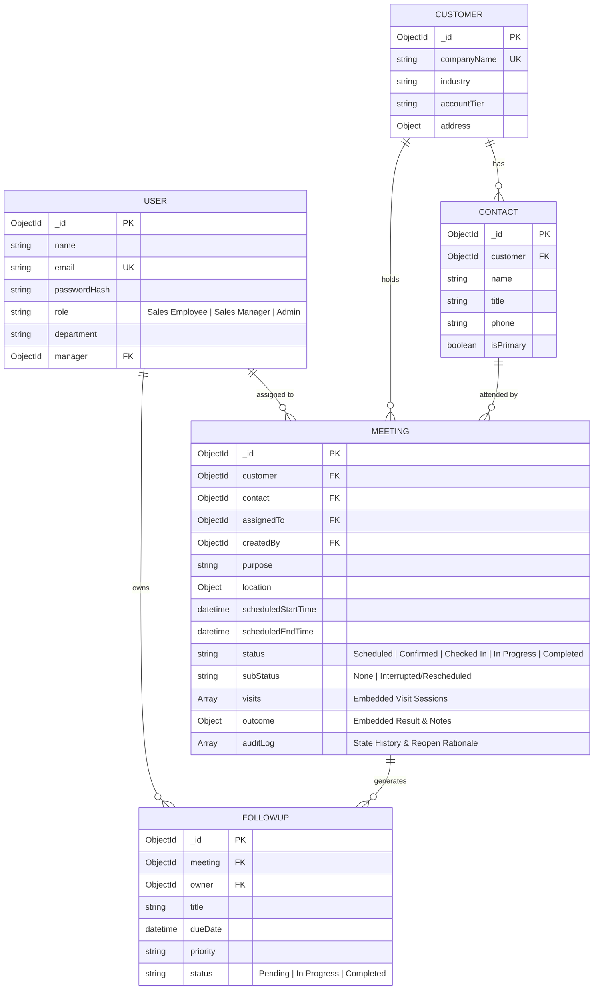

# Optronix Sales Meeting & Visit Management System

Production-structured, full-stack **Sales Meeting & Visit Management System** built for **Optronix Technical Assignment**. The system enables sales teams to schedule customer visits, perform geolocation-backed check-ins/check-outs, record mandatory outcomes, enforce business logic transitions, manage follow-up tasks, track historical visit sessions, and provide manager/admin oversight.

---

**Frontend** - https://sales-meeting-frontend.vercel.app/

**Backend** - https://sales-meeting-visit-management-system.onrender.com/api/ 

---
## Architecture Overview

Built using the **MERN Stack**:

- **Frontend**: React.js (Vite, React Router DOM, Custom Glassmorphism CSS Design System, Lucide Icons)
- **Backend**: Node.js + Express.js (Modular Controller-Service-Route architecture, JWT Auth, Custom Error Handler)
- **Database**: MongoDB (Mongoose ODM, Schema validation, Compound indexes, Embedded Visit Sessions Array, Audit Trail sub-documents)
- **Testing**: Node.js Native Test Runner (`node --test`, zero third-party test framework overhead)

```
                       +-----------------------------+
                       |    React.js SPA (Vercel)    |
                       +--------------+--------------+
                                      |
                                      | HTTPS / REST (JWT Bearer)
                                      v
                       +-----------------------------+
                       |   Node / Express (Render)   |
                       +--------------+--------------+
                                      |
                                      | Mongoose ODM
                                      v
                       +-----------------------------+
                       |      MongoDB Database       |
                       +-----------------------------+
```

---

## Folder Structure

```
assignment/
├── backend/
│   ├── src/
│   │   ├── config/
│   │   │   └── db.js                 # MongoDB connection logic
│   │   ├── controllers/
│   │   │   ├── analyticsController.js # Team activity & admin stats
│   │   │   ├── authController.js      # Login, Register, Profile
│   │   │   ├── customerController.js  # Customer & Contact CRUD
│   │   │   ├── followUpController.js  # Follow-up task management
│   │   │   ├── meetingController.js   # Lifecycle transitions & edge cases
│   │   │   └── userController.js      # User management & team lookup
│   │   ├── middleware/
│   │   │   ├── auth.js                # JWT token verification
│   │   │   ├── errorHandler.js        # Centralized API error handler
│   │   │   └── roles.js               # RBAC authorization middleware
│   │   ├── models/
│   │   │   ├── Contact.js             # Customer Contact person model
│   │   │   ├── Customer.js            # Account/Customer model
│   │   │   ├── FollowUp.js            # Follow-up action item model
│   │   │   ├── Meeting.js             # Core Meeting & Visit Session schema
│   │   │   └── User.js                # User accounts & roles model
│   │   ├── routes/
│   │   │   ├── analyticsRoutes.js
│   │   │   ├── authRoutes.js
│   │   │   ├── customerRoutes.js
│   │   │   ├── followUpRoutes.js
│   │   │   ├── meetingRoutes.js
│   │   │   └── userRoutes.js
│   │   ├── seed.js                    # Demo database seeder script
│   │   └── server.js                  # Express app entry & health check
│   ├── tests/
│   │   └── business_rules.test.js     # Automated business rule tests
│   ├── .env.example
│   └── package.json
│
├── frontend/
│   ├── src/
│   │   ├── components/
│   │   │   ├── CheckInModal.jsx       # Check-in timestamp & location modal
│   │   │   ├── CheckOutModal.jsx      # Check-out modal
│   │   │   ├── LifecycleStepper.jsx   # Visual state progress bar
│   │   │   ├── Navbar.jsx             # Top bar with Quick Demo Role Switcher
│   │   │   ├── OutcomeModal.jsx       # Outcome capture & follow-up prompt
│   │   │   ├── ReopenModal.jsx        # Manager meeting reopen modal
│   │   │   ├── RescheduleModal.jsx     # Interruption / Pause visit modal
│   │   │   ├── Sidebar.jsx            # Role-aware navigation sidebar
│   │   │   └── StatusBadge.jsx        # Color-coded status pills
│   │   ├── context/
│   │   │   └── AuthContext.jsx        # Auth state & token handling
│   │   ├── pages/
│   │   │   ├── AdminPanel.jsx         # Admin system administration
│   │   │   ├── CustomerManagement.jsx # Customer directory & contacts
│   │   │   ├── Dashboard.jsx          # KPI metrics & quick actions
│   │   │   ├── Login.jsx              # Login with 1-click role buttons
│   │   │   ├── MeetingCreateEdit.jsx  # Schedule meeting form
│   │   │   ├── MeetingDetail.jsx      # Lifecycle control, visit history & audit log
│   │   │   ├── MeetingList.jsx        # Searchable meeting table
│   │   │   └── TeamActivity.jsx       # Manager oversight & reopen access
│   │   ├── services/
│   │   │   └── api.js                 # Central API client
│   │   ├── App.jsx
│   │   ├── index.css                  # Custom CSS design system
│   │   └── main.jsx
│   ├── .env.example
│   ├── index.html
│   ├── package.json
│   └── vite.config.js
│
├── docs/
│   ├── DEPLOY_VERCEL.md               # Step-by-step Vercel frontend guide
│   └── DEPLOY_RENDER.md               # Step-by-step Render backend guide
└── README.md                          # Master documentation
```

---

## Prerequisites & Local Setup

### 1. Prerequisites

- **Node.js**: `v18.0.0` or higher
- **MongoDB**: Local MongoDB Server (`mongodb://localhost:27017`) or MongoDB Atlas connection string.

### 2. Dependencies Installation

Navigate to respective directories and install dependencies:

```bash
# Install backend dependencies
cd backend
npm install

# Install frontend dependencies
cd ../frontend
npm install
```

---

## Environment Variables Configuration

### Backend Environment (`backend/.env`)

Create a `.env` file in `backend/`:

```env
PORT=5000
NODE_ENV=development
MONGODB_URI=mongodb://localhost:27017/sales_management
JWT_SECRET=optronix_sales_management_jwt_secret_key_2026_change_in_production
JWT_EXPIRES_IN=7d
CLIENT_URL=http://localhost:5173
```

### Frontend Environment (`frontend/.env`)

Create a `.env` file in `frontend/`:

```env
VITE_API_BASE_URL=http://localhost:5000/api
```

---

## Database Initialization & Seeding

Populate the database with realistic demo accounts, enterprise customers, contacts, and sample meeting lifecycles (including the 10:02 AM rescheduling scenario):

```bash
cd backend
npm run seed
```

### Default Demo Credentials

| Role               | Email                   | Password      | Access Privileges                                                      |
| :----------------- | :---------------------- | :------------ | :--------------------------------------------------------------------- |
| **Sales Employee** | `employee@optronix.com` | `password123` | Own meetings, Check-In/Out, Record outcome, Create follow-ups          |
| **Sales Manager**  | `manager@optronix.com`  | `password123` | Team activity dashboard, View team meetings, Reopen completed meetings |
| **Admin**          | `admin@optronix.com`    | `password123` | Full system administration, User management, Global metrics oversight  |

---

## How to Run Frontend & Backend

### Start Backend API Server

```bash
cd backend
npm run dev
# Server listens at http://localhost:5000
```

### Start Frontend Web App

```bash
cd frontend
npm run dev
# Web application available at http://localhost:5173
```

---

## Running Automated Backend Tests

Execute the 6 core business rule unit/integration tests using Node.js native test runner:

```bash
cd backend
npm test
```

Test output:

```text
✔ Business Rule 1: Reject invalid lifecycle transition (Scheduled directly to Completed without Check-In)
✔ Business Rule 2: Unauthorized role cannot reopen a completed meeting (Sales Employee rejected, Manager allowed)
✔ Business Rule 3: Mandatory outcome required before completing a meeting
✔ Business Rule 4: Mandatory follow-up enforcement when 'Follow-up Required' is selected
✔ Business Rule 5: Preservation of meeting history & timestamps during 10:02 AM rescheduling scenario
✔ Business Rule 6: Manager reopening a completed meeting records audit log & resets status
```

---

## MongoDB Database Model & ER Diagram

### Database Architecture

1. **User**: Credentials, role (`Sales Employee`, `Sales Manager`, `Admin`), department, manager reference.
2. **Customer**: Company details, industry, account tier (`Enterprise`, `Mid-Market`, `SMB`), address.
3. **Contact**: Person name, title, email, phone, associated customer ID.
4. **Meeting**: Scheduled start/end times, purpose, location, assigned employee, status (`Scheduled`, `Confirmed`, `Checked In`, `In Progress`, `Completed`), embedded `visits` array, embedded `outcome` sub-document, and `auditLog` array.
5. **FollowUp**: Linked meeting, title, task owner ID, due date, priority, status.

### Mermaid ER Diagram



---

## Meeting Lifecycle & Business Rules

```text
Scheduled ──> Confirmed ──> Checked In ──> In Progress ──> Completed
  │                             ▲               │
  └─────────────────────────────┴───────────────┴──> Interrupted / Rescheduled (Session Paused)
                                                        │
                                   Reopened by Manager ──┘
```

### Enforced Business Rules:

1. **Strict Lifecycle Sequence**: A meeting cannot transition directly from `Scheduled` or `Confirmed` to `Completed` without a recorded Check-In visit.
2. **Mandatory Outcome**: Meeting cannot be completed without recording an outcome result (`Interested`, `Follow-up Required`, `Proposal Requested`, `Not Interested`, `Unable to Meet`).
3. **Mandatory Follow-up Enforcement**: If `Follow-up Required` outcome is selected, a follow-up action with owner and due date is strictly required by the backend API.
4. **Manager Reopening Permission**: Completed meetings can ONLY be reopened by a `Sales Manager` or `Admin`. Reopening requires a mandatory audit rationale string (minimum 5 chars) and moves state back to `In Progress`.
5. **Geolocation & Timestamp Logging**: Every check-in and check-out event logs timestamp and GPS/address location metadata.

---

## Design Scenario Handling: 10:02 AM Rescheduling Interruption

### Scenario Description

> _A salesperson checks into a customer meeting at 10:02 AM. The meeting was scheduled for 10:00–11:00 AM. At 10:40 AM, the customer asks them to return at 3:00 PM instead. The salesperson returns at 3:10 PM and completes the meeting at 4:00 PM._

### Technical Design Solution

Rather than overwriting historical timestamps or updating scheduled start times, the application implements a **Visit Session History Array** (`visits: []`) inside the Meeting model:

```json
{
  "scheduledStartTime": "2026-09-15T10:00:00.000Z",
  "scheduledEndTime": "2026-09-15T11:00:00.000Z",
  "status": "Completed",
  "subStatus": "None",
  "visits": [
    {
      "sessionIndex": 1,
      "checkInTime": "2026-09-15T10:02:00.000Z",
      "checkOutTime": "2026-09-15T10:40:00.000Z",
      "sessionStatus": "Paused/Rescheduled",
      "interruptionReason": "Customer requested return at 3:00 PM due to urgent executive meeting",
      "rescheduledReturnTime": "2026-09-15T15:00:00.000Z"
    },
    {
      "sessionIndex": 2,
      "checkInTime": "2026-09-15T15:10:00.000Z",
      "checkOutTime": "2026-09-15T16:00:00.000Z",
      "sessionStatus": "Completed"
    }
  ]
}
```

### Audit Preservation Benefits:

1. **Preserves Original SLA**: `scheduledStartTime` (10:00 AM) remains intact for punctuality analytics.
2. **Audit Accuracy**: Session 1 arrival (10:02 AM) and departure (10:40 AM) are preserved in database audit logs.
3. **Session 2 Logging**: Resumed visit arrival (3:10 PM) and check-out (4:00 PM) are appended seamlessly.

---

## Complete REST API Documentation

| Method  | Endpoint                               | Purpose                                 | Required Role        | Request Body / Parameters                                                            |
| :------ | :------------------------------------- | :-------------------------------------- | :------------------- | :----------------------------------------------------------------------------------- |
| `POST`  | `/api/auth/login`                      | Authenticate user & get JWT token       | Public               | `{ email, password }`                                                                |
| `GET`   | `/api/auth/me`                         | Get active user profile                 | Authenticated        | Header `Bearer <token>`                                                              |
| `GET`   | `/api/meetings`                        | Get list of meetings (filtered)         | Authenticated        | Query `?status=&assignedTo=&search=`                                                 |
| `GET`   | `/api/meetings/:id`                    | Get meeting details & audit trail       | Authenticated        | URL Param `id`                                                                       |
| `POST`  | `/api/meetings`                        | Schedule new meeting                    | Authenticated        | `{ customerId, contactId, purpose, location, scheduledStartTime, scheduledEndTime }` |
| `PATCH` | `/api/meetings/:id/confirm`            | Confirm scheduled meeting               | Authenticated        | URL Param `id`                                                                       |
| `POST`  | `/api/meetings/:id/check-in`           | Check in to meeting                     | Assigned Rep / Admin | `{ location: { address, latitude, longitude }, notes }`                              |
| `POST`  | `/api/meetings/:id/pause-reschedule`   | Pause visit session (10:02 AM scenario) | Assigned Rep / Admin | `{ interruptionReason, rescheduledReturnTime, notes }`                               |
| `POST`  | `/api/meetings/:id/check-out-complete` | Check out & complete with outcome       | Assigned Rep / Admin | `{ outcome: { result, notes }, followUp: { title, ownerId, dueDate } }`              |
| `POST`  | `/api/meetings/:id/reopen`             | Reopen completed meeting                | Manager / Admin      | `{ reason: "Rationale string" }`                                                     |
| `GET`   | `/api/customers`                       | Get customer accounts directory         | Authenticated        | None                                                                                 |
| `POST`  | `/api/customers`                       | Create new customer account             | Authenticated        | `{ companyName, industry, accountTier, phone }`                                      |
| `GET`   | `/api/customers/:id/contacts`          | Get contacts for customer               | Authenticated        | URL Param `id`                                                                       |
| `POST`  | `/api/customers/:id/contacts`          | Create contact person                   | Authenticated        | `{ name, title, phone, email }`                                                      |
| `GET`   | `/api/followups`                       | Get follow-up task items                | Authenticated        | Query `?status=&owner=`                                                              |
| `POST`  | `/api/followups`                       | Create follow-up action                 | Authenticated        | `{ meetingId, title, ownerId, dueDate, priority }`                                   |
| `GET`   | `/api/analytics/team-activity`         | Manager team activity metrics           | Manager / Admin      | None                                                                                 |
| `GET`   | `/api/analytics/admin-stats`           | System overview stats                   | Admin                | None                                                                                 |

---

## Decisions & Trade-offs

### Assumptions

1. **Sales Employee Isolation**: Sales employees primarily view their assigned meetings or created visits, while Managers and Admins access team-wide meetings.
2. **Simplified Geolocation**: GPS coordinates are accepted from standard browser geolocation APIs or simulated inputs during check-in.

### Limitations & Trade-offs

1. **In-Memory Fallback for Tests**: Automated unit tests use native `node:test` assertions to enable test execution even without an active MongoDB connection.
2. **Mock Push Notifications**: Follow-up due date alerts are logged and tracked via UI badges rather than sending emails.

### Production Enhancements

1. **Real-time WebSockets**: Implement Socket.io for live team activity updates on Sales Manager dashboards.
2. **Offline Mobile PWA**: Add IndexedDB persistence for offline field check-ins in remote customer locations.
